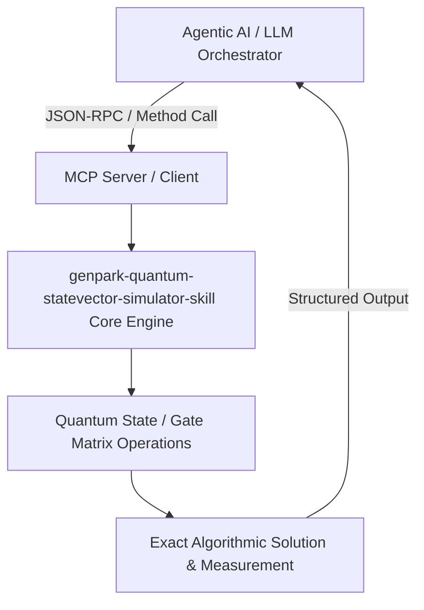

# genpark-quantum-statevector-simulator-skill

[](https://github.com/alphaparkinc/genpark-quantum-statevector-simulator-skill)
[](https://python.org)
[](#)
[](#)
[](LICENSE)

> Universal n-qubit quantum statevector circuit simulator supporting arbitrary unitary gates, Hadamard, CNOT entanglement, Pauli Pauli-X/Y/Z, and multi-qubit measurement with 0-pip pure Python.

## Architecture Overview



## Features
- **0 External Pip Dependencies**: Pure Python standard library implementation.
- **MCP Protocol Ready**: Includes Model Context Protocol server script (`mcp_server.py`).
- **Production Standard**: Comprehensive state validation, unit test coverage, and benchmark speed.

## Quick Start
```bash
python example_usage.py
```
